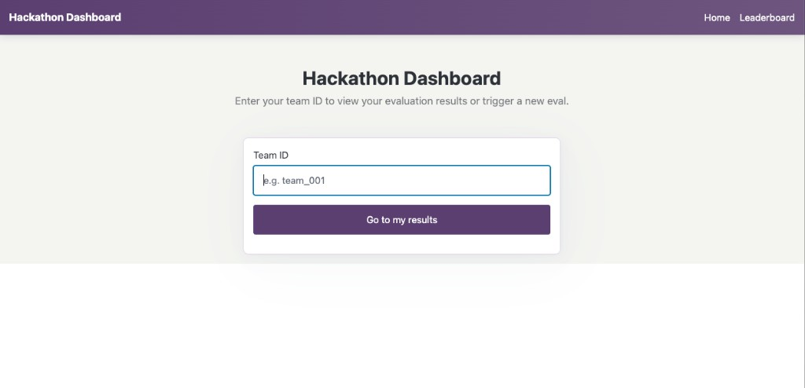
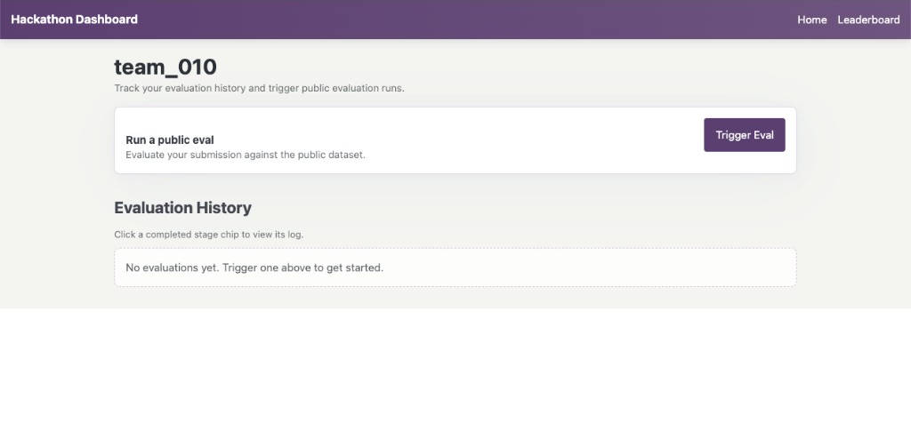
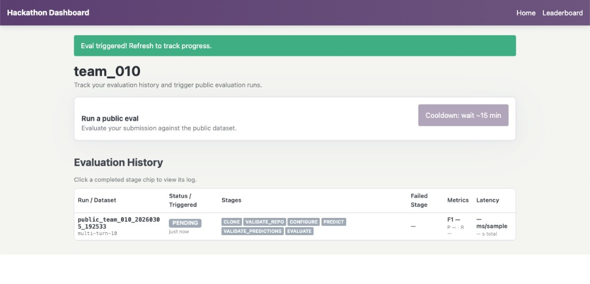
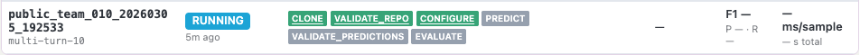
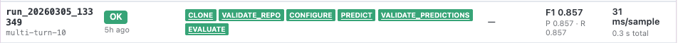
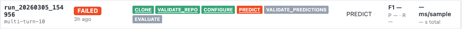
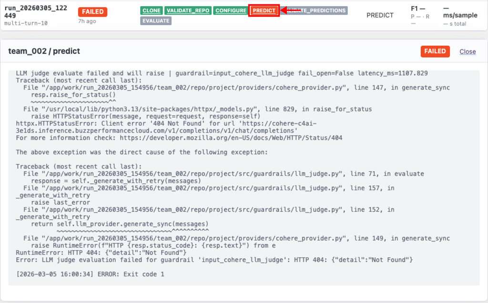
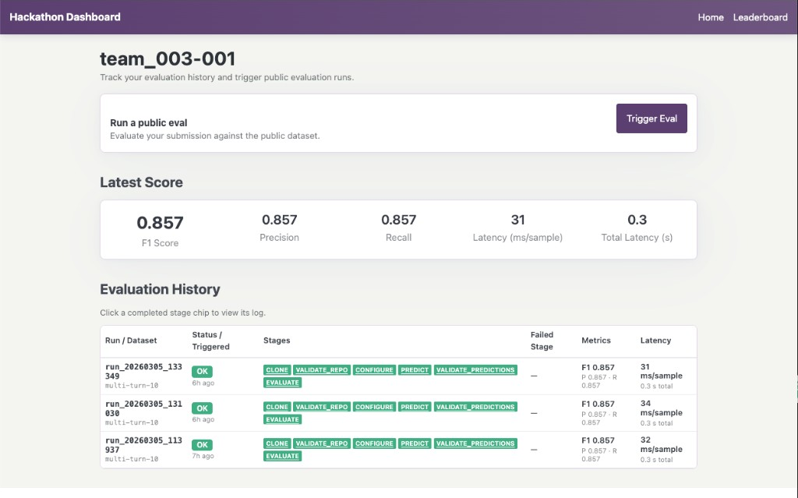
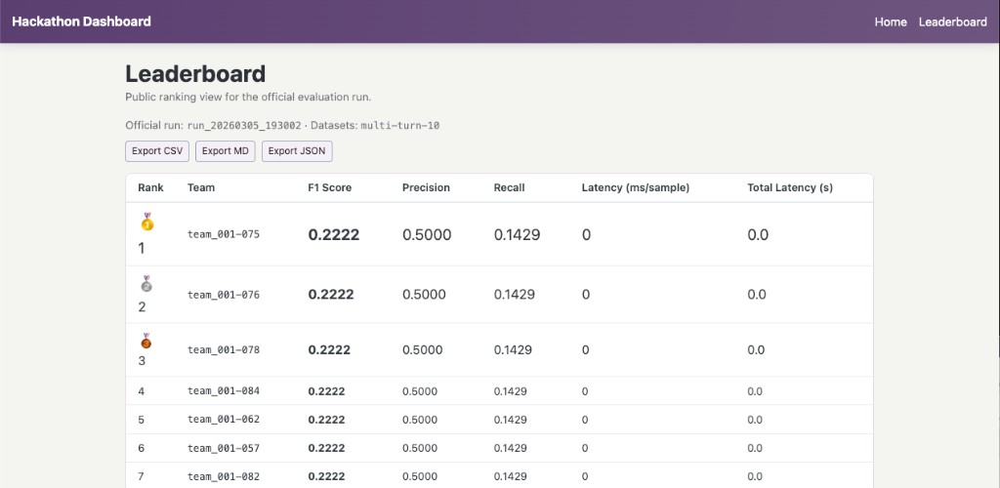

# Evaluation Dashboard & Pipeline Guide

This guide covers the **evaluation side** of the hackathon: how the automated pipeline evaluates your submission, and how to use the **Evaluation Dashboard** to trigger runs, interpret results, diagnose failures, and track your standing on the leaderboard.

For building, testing, and submitting your guardrail, refer to the **[Quickstart Guide](quickstart_guide.md)**.

> **Important:** The chatbot app and this dashboard are for **stress testing, data gathering, and debugging only**. Neither trains your model automatically. If you discover failures or collect new examples from the chatbot, you must retrain/update your model manually, then commit the code/artifacts and push before re-running.

> **Prerequisite:** Make sure you've read the [Quickstart Guide](quickstart_guide.md) first. This guide assumes your local `configure -> predict -> evaluate` workflow already passes.

<br>

---

<br>

## What You Need to Change

Your team's repo is scaffolded with template scripts, frameworks, and example submissions. Out of all those files, you only need to customize **two**:

| File | Purpose |
|------|---------|
| `hackathon.json` | Declares GPU requirement and model artifacts |
| `project/src/submission/submission.py` | Your guardrail logic via `get_guardrails()` |

Everything else — `configure.sh`, `predict.sh`, `evaluate.sh`, the guardrails framework, providers — is shared scaffold. **Do not modify the shared scripts.**

<br>

### `hackathon.json`

This file lives at your **repo root** and has two required fields: `needs_gpu` and `artifacts`.

The `configure` stage validates both strictly — missing or malformed fields will fail your run.

<br>

**LLM-based approach** (no GPU, no model downloads):

```json
{
  "needs_gpu": false,
  "artifacts": []
}
```

**Fine-tuned model approach** (GPU required, model downloaded from S3):

```json
{
  "needs_gpu": true,
  "artifacts": [
    {
      "uri": "s3://your-bucket/your-team/model.tar.gz",
      "destination": "project/models",
      "sha256": "abc123...",
      "required": true
    }
  ]
}
```

<br>

**Field reference:**

| Field | Type | Description |
|-------|------|-------------|
| `needs_gpu` | boolean | `true` if your guardrail requires CUDA/GPU at runtime. The pipeline verifies CUDA availability and fails fast if it's missing. Set `false` for CPU-only approaches. |
| `artifacts` | list | Model files to download during `configure`. Use an empty list `[]` if you don't need external model weights. |

Each entry in the `artifacts` list contains:

| Field | Type | Description |
|-------|------|-------------|
| `uri` | string | S3 or HTTPS URL of the artifact (e.g. `s3://bucket/key/model.tar.gz`) |
| `destination` | string | Path relative to repo root where the artifact is extracted or copied (e.g. `project/models`) |
| `sha256` | string | SHA-256 hash for integrity verification |
| `required` | boolean | If `true`, a download failure stops the run. If `false`, the pipeline logs a warning and continues |

> See the [Quickstart Guide — Step 16: Configure `hackathon.json`](quickstart_guide.md#step-16--configure-hackathonjson) for how to upload artifacts to S3 using `publish_artifact.sh` and generate the entry for `hackathon.json`.

<br>

### `submission.py`

Your guardrail logic lives in `project/src/submission/submission.py`. It must define a `get_guardrails()` function that returns `(input_guardrail, None)`.

The [Quickstart Guide — Step 14: Edit `submission.py`](quickstart_guide.md#step-14--edit-submissionpy) covers this contract in detail — just make sure whatever you return works end-to-end locally before triggering a dashboard evaluation.

<br>

---

<br>

## How the Evaluation Pipeline Works

When you trigger an evaluation (or an organizer triggers an official run), the pipeline executes **six stages** in sequence. Each stage must succeed for the next one to run.

| Stage | What it does |
|-------|-------------|
| **1. Clone** | Shallow-clones your team's GitHub repo |
| **2. Validate Repo** | Checks that `hackathon.json` exists and reads `needs_gpu`. Verifies `configure.sh` and `predict.sh` are present. |
| **3. Configure** | Runs your `configure.sh` — installs dependencies, downloads artifacts from `hackathon.json`, checks CUDA if `needs_gpu: true` |
| **4. Predict** | Runs your `predict.sh` against the evaluation dataset and produces a predictions CSV |
| **5. Validate Predictions** | Checks that the predictions CSV has the required columns and correct row count |
| **6. Evaluate** | Computes precision, recall, F1, and latency from your predictions |

<br>

### Predictions output contract

Your `predict.sh` must produce a CSV with these columns:

| Column | Required? | Description |
|--------|-----------|-------------|
| `combined_pred` | **Yes** | Your guardrail's prediction (`true`/`false` or `1`/`0`) |
| `label` or `label_harmful` | **Yes** | Ground-truth label, carried over from the input dataset |
| `latency_ms` | Recommended | Per-sample latency in milliseconds — used as a tiebreaker on the leaderboard |

The row count must match the input dataset exactly. Extra columns are allowed but ignored.

<br>

---

<br>

## Accessing the Dashboard

1. Navigate to [https://evaluation-app.hackathon.buzzperformancecloud.com/public/dashboard](https://evaluation-app.hackathon.buzzperformancecloud.com/public/dashboard)
2. Enter your assigned team ID (e.g. `team_001`) — no password required
3. Click **"Go to my results"**



You'll land on your **team page**, which shows your trigger button, latest score, and full evaluation history.

<br>

---

<br>

## Triggering an Evaluation

On your team page, the **"Run a public eval"** card lets you evaluate your submission against the **public** test dataset selected by the organizers. This is the dataset you can run against at any time during the hackathon. The **private full dataset** is reserved for the final evaluation run by the organizers/evaluators.



<br>

**How it works:**

1. Click **"Trigger Eval"**
2. Your run appears in the Evaluation History table below
3. The table **auto-refreshes every few seconds** while the run is in progress — no need to manually reload

The evaluation pipeline always runs against the latest version of your code that is pushed to your team's GitHub repo at trigger time.

<br>

**Cooldown:** After triggering, the button is disabled for **15 minutes**. It will appear greyed out with a message until the cooldown expires.



<br>

**No public dataset yet?** If the organizers haven't configured one, you'll see *"No public dataset is configured yet. Check back later."* instead of the trigger button.

> **Tip:** Always run the `configure -> predict -> evaluate` workflow locally before triggering a dashboard evaluation. A run that fails at the `configure` or `predict` stage still counts toward your cooldown.

<br>

---

<br>

## Viewing a Run & Understanding Stages

### Evaluation History

Each row in your evaluation history shows:

| Column | What it shows |
|--------|---------------|
| **Run / Dataset** | The run ID and which dataset was used |
| **Status / Triggered** | A status badge (OK, FAILED, RUNNING, CANCELLED) and how long ago |
| **Stages** | Colored chips for each pipeline stage — green = passed, red = failed, grey = not reached |
| **Metrics** | F1, Precision, and Recall (if the run completed) |
| **Latency** | Average ms/sample and total seconds |

<br>

A run that is currently in progress:



A successful run — all stage chips green, metrics populated:



A failed run — the failed stage is red, and stages after it were not reached:



<br>

### Viewing stage logs

Completed stage chips are **clickable**. Click any green or red chip to expand the full log inline below the table. This is your primary debugging tool — if a stage fails, the log contains the error explaining why.



<br>

### Common failures

| Failed Stage | Likely Cause | What to Check |
|--------------|--------------|---------------|
| **clone** | Repo access issue | Is your repo URL correct and accessible? Have you pushed your latest changes? |
| **validate_repo** | Missing required files | Does `hackathon.json` exist at repo root? Do `configure.sh` and `predict.sh` exist? |
| **configure** | Dependency or artifact problem | Are all dependencies in `pyproject.toml`/`requirements.txt`? Are artifact fields correct in `hackathon.json`? If `needs_gpu: true`: is CUDA available? |
| **predict** | Runtime error in your guardrail | Does `get_guardrails()` in `submission.py` return without error? Does your guardrail handle all input rows? |
| **validate_predictions** | Output CSV malformed | Does your output have a `combined_pred` column? Does the row count match the input dataset? |
| **evaluate** | Metrics computation error | Rare. Usually means `combined_pred` or label columns have unexpected values. |

<br>

---

<br>

## Understanding the Metrics

The evaluation computes five metrics from your predictions. The positive class is **harmful** (high-risk).

| Metric | Formula | What it means |
|--------|---------|---------------|
| **Precision** | TP / (TP + FP) | Of everything flagged as harmful, how much actually was? High precision = few false alarms. |
| **Recall** | TP / (TP + FN) | Of all harmful inputs, how many did your guardrail catch? High recall = few missed threats. |
| **F1 Score** | 2 x P x R / (P + R) | Balance between precision and recall. **Primary ranking metric.** |
| **Latency (ms/sample)** | mean(`latency_ms`) | Average processing time per input. **Tiebreaker on the leaderboard.** |
| **Total Latency (s)** | sum(`latency_ms`) / 1000 | Total wall-clock time across all samples. |

<br>

Where:

- **True positive (TP)** = your guardrail correctly identified a harmful input
- **False positive (FP)** = your guardrail blocked a safe input (false alarm)
- **False negative (FN)** = your guardrail let a harmful input through (missed threat)

<br>

**Key takeaway:** Maximize F1 first. If two teams tie on F1, the faster one ranks higher.

<br>



<br>

---

<br>

## The Leaderboard

The **Leaderboard** tab in the navigation bar shows team rankings. It operates in three modes that the organizers activate over the course of the hackathon:

<br>

**Coming Soon** — A placeholder. The leaderboard isn't available yet.

**Own Only** — You can look up your own results by team ID, but you can't see other teams.

**Full Leaderboard** — All teams ranked in a public table.

<br>

In the full leaderboard, teams are ranked by **F1 Score (descending)**. Ties are broken by **Latency ms/sample (ascending)** — faster wins.

The table shows: Rank, Team, F1 Score, Precision, Recall, Latency (ms/sample), and Total Latency (s). During an active official run, you'll also see sections for teams that are still In Progress, Pending, Failed, or Cancelled.

<br>



<br>

---

<br>

## Pre-flight Checklist

Before triggering a dashboard evaluation, run through this list:

- [ ] `hackathon.json` exists at repo root with valid `needs_gpu` (boolean) and `artifacts` (list)
- [ ] `project/scripts/configure.sh` and `project/scripts/predict.sh` exist
- [ ] `project/src/submission/submission.py` implements `get_guardrails()` returning `(input_guardrail, None)`
- [ ] All dependencies declared in `pyproject.toml` or `requirements.txt`
- [ ] If using a fine-tuned model: artifact uploaded to S3 and entry added to `hackathon.json` with correct `uri`, `destination`, `sha256`, `required`
- [ ] Local workflow passes: `configure.sh` -> `predict.sh` -> `evaluate.sh`
- [ ] Predictions CSV contains `combined_pred` column and row count matches input
- [ ] All changes committed and **pushed** to your team's GitHub repo
- [ ] If you changed training data/prompts from dashboard findings, retrain/update manually and push those updates before triggering
