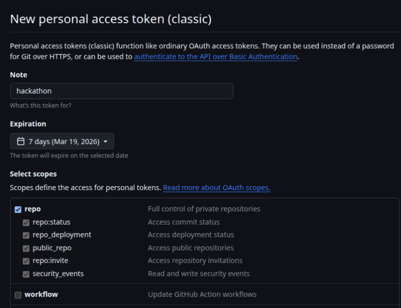

# Quickstart Guide

This guide walks you through every step — from opening your compute environment to seeing your first evaluation score on the dashboard. Follow it in order. Each step builds on the previous one.

By the end, you'll have:

- A working development environment
- A successful local test run with the default template
- Your own guardrail logic running in `submission.py`
- Your first score on the evaluation dashboard

<br>

**Other guides you'll reference along the way:**

| Guide                                                         | What it covers                                               |
| ------------------------------------------------------------- | ------------------------------------------------------------ |
| [Evaluation Dashboard Manual](evaluation_dashboard_manual.md) | Dashboard UI, triggering evals, reading results, leaderboard |
| [Guardrails README](../project/src/guardrails/README.md)      | Guardrail framework API, built-in implementations, stacking  |
| [Data Generation Manual](data_generation_manual.md)           | Creating training data, taxonomy, DEI guidance               |
| [Red-Team Playbook](red_team_playbook.md)                     | Adversarial testing strategies for the KHP VA baseline       |

<br>

---

<br>

## Phase 1: Get Into Your Environment

<br>

### Step 1 — Open your JupyterLab

Each team has a dedicated compute node running JupyterLab on the BuzzHPC cloud. You'll receive two things from the organizers:

- A **JupyterLab URL** (e.g. `https://<your-team>-notebook-3e1ds.notebook.buzzperformancecloud.com`)
- An **access token**

Open the URL in your browser and enter the token when prompted. You'll land in JupyterLab with a file browser on the left and a launcher on the right.

<br>

**Open a terminal:** Click **File > New > Terminal** (or use the Terminal tile in the launcher). You'll use this terminal for all the shell commands in this guide.

<br>

### Step 2 — Check your environment

Verify that Python is available and at the right version:

```bash
python3 --version
```

You should see **Python 3.12** or later (the current environment ships with 3.13). If not, ask an organizer.

<br>

### Step 3 — Clone your team's repo

> **GitHub authentication on BuzzHPC:** The JupyterLab environment does **not** support GitHub username/password authentication. When prompted for credentials during `git clone`, `git push`, or any git operation, you must use your **GitHub username** and a **Personal Access Token (PAT)** — not your GitHub password.
>
> To create a PAT: go to **GitHub > Settings > Developer settings > Personal access tokens > Tokens (classic)**, generate a new token with `repo` scope, and copy it. Use this token wherever git asks for a password. See [GitHub's PAT documentation](https://docs.github.com/en/authentication/keeping-your-account-and-data-secure/managing-your-personal-access-tokens) for full instructions.



You'll receive a GitHub repo URL for your team. Clone it:

```bash
git clone <your-team-repo-url>
cd <your-repo-folder>
```

Verify the structure looks right:

```bash
ls
```

You should see:

```
datasets/  docs/  hackathon.json  project/  pyproject.toml  README.md  ...
```

<br>

### Step 4 — Set up environment variables

The `.env` file is already present in your repo with **LLM provider keys pre-populated** (Cohere, Mistral, OpenAI). You do not need to add or change any LLM keys.

> **Important:** The `.env` file is hidden and will **not** appear in the JupyterLab file explorer. You must access it through the terminal using `nano .env` (or another terminal editor). This is expected behavior for dotfiles. Do **not** overwrite the file — the LLM keys are already set.

<br>

**S3 credentials** — the only values you need to fill in are your S3 access key and secret key, which will be provided by the organizers. These are required if you plan to upload model artifacts with `publish_artifact.sh` (fine-tuned model approach). Open the file with `nano .env` and update the S3 section:

```
S3_BUCKET_NAME="hackathon-s3-bucket-999-e8b3s"    # already set — do not change
S3_ENDPOINT_URL="https://10.2.16.3"                # already set — do not change
S3_ACCESS_KEY="<your-s3-access-key>"               # replace with your provided key
S3_SECRET_KEY="<your-s3-secret-key>"               # replace with your provided key
```

> **Note:** `S3_BUCKET_NAME` and `S3_ENDPOINT_URL` are shared across all teams and are already set to the correct values. You only need to fill in `S3_ACCESS_KEY` and `S3_SECRET_KEY` with the credentials provided by the organizers. If you don't plan to upload model artifacts, you can leave the S3 key fields blank.
>
> The `.env` file is git-ignored and should never be committed. It's loaded automatically by `python-dotenv` when your submission runs.

<br>

### Step 5 — Run configure to build your environment

This is the key setup step. From the **repository root**, run:

```bash
./project/scripts/configure.sh
```

`configure.sh` does everything for you:

1. Creates a `.venv` virtual environment (if one doesn't exist)
2. Installs all dependencies from `pyproject.toml` (or `requirements.txt` if present)
3. Installs `ipykernel` for notebook support
4. Validates `hackathon.json` (checks `needs_gpu` and `artifacts` fields)
5. Downloads any model artifacts listed in `hackathon.json`
6. If `needs_gpu: true`, verifies CUDA is available

You should see `OK` at the end. If it fails, read the error — it's usually a malformed `hackathon.json` or a missing dependency.

<br>

### Step 6 — Activate the virtual environment

`configure.sh` created the venv, but you need to activate it in your terminal so that `predict.sh`, `evaluate.sh`, and any Python commands use the right packages:

```bash
source .venv/bin/activate
```

> **Important:** You'll need to run this every time you open a new terminal in JupyterLab. The `configure.sh` script doesn't need activation (it uses `.venv/bin/python` directly), but `predict.sh`, `evaluate.sh`, and any `python` commands you run yourself do.

<br>

### Step 7 — Verify the install

Run a quick smoke test from the `project/` directory:

```bash
cd project
PYTHONPATH=. python -c "
from providers.base import LLMMessage
from providers.demo_provider import DemoProvider
llm = DemoProvider(model='demo')
print(llm.generate_sync([LLMMessage(role='user', content='Hello')]).content)
"
```

If you see a response printed, your environment is working. Go back to the repo root:

```bash
cd ..
```

<br>

> **Milestone:** Your environment is set up. Python, dependencies, and provider access are all working.

<br>

---

<br>

## Phase 2: Get Your First Run (Before Writing Any Code)

Before changing anything, run the full evaluation pipeline with the **default template submission**. This proves your environment works end-to-end and shows you what the output looks like.

Configuration already ran in Step 5, so you can go straight to predict and evaluate. The full pipeline is always **configure -> predict -> evaluate**, but you only need to re-run configure when dependencies change.

<br>

### Step 8 — Run predict

```bash
./project/scripts/predict.sh datasets/seed_validation_set.csv results/predictions.csv
```

This loads the default guardrail from `submission.py`, runs it on every row in the validation dataset, and writes a predictions CSV.

<br>

### Step 9 — Run evaluate

```bash
./project/scripts/evaluate.sh results/predictions.csv results/eval_metrics.csv
```

This computes precision, recall, F1, and latency from your predictions. Open `results/eval_metrics.csv` or `results/eval_metrics.json` to see the numbers.

<br>

### Step 10 — Register the notebook kernel

`configure.sh` already installed `ipykernel`, so you just need to register it. From the repo root with your venv activated:

```bash
python -m ipykernel install --user --name=aiss --display-name="Python (aiss)"
```

> **Important:** After registering, you must select the correct as the kernel every time you open a notebook in JupyterLab. The environment may default to a different kernel (e.g. the base Python kernel), which will not have your project dependencies installed. To change the kernel: click **Kernel > Change Kernel** in the menu bar and select. If you see `ModuleNotFoundError` when running notebook cells, this is almost always a wrong-kernel issue.

<br>

### Step 11 — Explore results in the evaluation notebook

Open `project/notebooks/guardrail_evaluation.ipynb` in JupyterLab and select the **"Python (aiss)"** kernel.

This notebook goes deeper than the command-line scripts. It loads a submission module, runs the guardrail on the validation data, and gives you:

- **Aggregate metrics** — precision, recall, F1, latency
- **Full predictions table** — every sample with its ground-truth label, your guardrail's prediction, and per-sample latency
- **Confusion matrix** — TP, FP, TN, FN counts at a glance
- **False positive analysis** — low-risk content your guardrail incorrectly flagged (false alarms)
- **False negative analysis** — high-risk content your guardrail missed (the dangerous ones)
- **Latency distribution** — how inference time varies across samples

To use it with the default template, update the `SUBMISSION_MODULE` path in Cell 2 to point to your chosen example (e.g. `example_submission_cohere_llm_judge.py` or `example_submission.py`) and run all cells.

> **Tip:** This notebook is your best iteration tool. After every change to your guardrail, re-run it to see exactly which samples you're getting wrong and why. The false-negative list is especially valuable — those are the harmful inputs slipping through.

<br>

> **Milestone:** You've completed your first local evaluation. The metrics are from the default template — they're the baseline you'll beat.

<br>

---

<br>

## Phase 3: Stress Test the Chatbot & Gather Data

Now that your pipeline works, spend time understanding the KHP Virtual Assistant's behavior so you know what failures your guardrail needs to catch. The chatbot app and notebook are your primary tools for **exploring vulnerabilities** and **generating training data**.

> **Key concept:** The chatbot is a stress-testing and data-gathering tool only. It does **not** train your model automatically. Use it to find where the VA fails, collect realistic examples, and then manually incorporate those findings into your training data and report.

<br>

### Step 12 — Explore the KHP VA

Open `project/notebooks/explore_khp_virtual_assistant_cohere.ipynb` in JupyterLab. Select the **"Python (aiss)"** kernel.

Run the setup cells, then start testing the VA with your own prompts. Try:

- Normal, safe questions ("How can I manage exam stress?")
- Emotionally intense but non-crisis messages
- Scenarios where a distressed user might receive harmful or unhelpful responses
- Edge cases where risk signals are ambiguous or indirect

You can also test the VA interactively at the chatbot app: [https://chatbot-app.hackathon.buzzperformancecloud.com/](https://chatbot-app.hackathon.buzzperformancecloud.com/)

> **What to focus on:** Look for realistic situations a user in distress might actually encounter — not malicious prompt injection or hacker-style attacks. Where does the chatbot miss risk cues? Where does it under-escalate? Where might it inadvertently encourage unsafe choices?

<br>

Treat the KHP chatbot and notebooks as **stress-testing and data-collection tools**. Document what you find — these observations should be added to your report and should inform your guardrail design. Any useful conversation examples can become training data for your model. See the [Red-Team Playbook](red_team_playbook.md) for structured testing strategies.

<br>

---

<br>

## Phase 4: Build Your Guardrail

<br>

### Step 13 — Choose your approach

| Approach                                | Pros                              | Cons                            | GPU needed? |
| --------------------------------------- | --------------------------------- | ------------------------------- | ----------- |
| **LLM judge**                           | Quick to implement, good baseline | Slower inference, API-dependent | No          |
| **Fine-tuned classifier** (e.g. mmBERT) | Fast inference, best F1 potential | Needs training data and GPU     | Yes         |
| **Custom guardrail**                    | Full control                      | More engineering effort         | Depends     |
| **Stacked** (e.g. classifier + LLM)     | Best of both worlds               | More complexity                 | Depends     |

> **Fastest start:** Copy the LLM judge example into your `submission.py`. You can always layer in a classifier later.

For details on the guardrail API, built-in implementations, and how stacking works, see the [Guardrails README](../project/src/guardrails/README.md).

<br>

### Step 14 — Edit `submission.py`

Open `project/src/submission/submission.py`. This is the **only code file** the evaluation pipeline loads. It must define:

```python
def get_guardrails() -> tuple[input_guardrail, output_guardrail]:
    ...
    return (your_input_guardrail, None)
```

The default `submission.py` delegates to `example_submission.py`. Replace that delegation with your own logic. Example submissions to reference:

| File                                              | Approach                        |
| ------------------------------------------------- | ------------------------------- |
| `example_submission_cohere_llm_judge.py`          | LLM judge using Cohere          |
| `example_submission_gptoss_llm_judge.py`          | LLM judge using OpenAI          |
| `example_submission_mmbert_guardrail.py`          | Fine-tuned mmBERT classifier    |
| `example_submission_mmbert_base_no_finetuning.py` | Base mmBERT without fine-tuning |
| `example_stacked_llm_model.py`                    | Stacked: LLM + classifier       |
| `example_stacked_mmbert_twice.py`                 | Stacked: two classifiers        |

All example files live in `project/src/submission/`. Read the one that matches your chosen approach, then adapt the logic into your `submission.py`.

<br>

### Step 15 — Update dependencies (if needed)

If your approach requires packages not already in the template, add them to `**pyproject.toml**` (under `dependencies`) or create a `**requirements.txt**` at the repo root.

`configure.sh` checks for `requirements.txt` first, then falls back to `pyproject.toml`. Either works.

<br>

### Step 16 — Configure `hackathon.json`

Update the file at your repo root based on your approach:

<br>

**LLM-only (no GPU, no artifacts):**

```json
{
  "needs_gpu": false,
  "artifacts": []
}
```

**Fine-tuned model (GPU + S3 artifact):**

```json
{
  "needs_gpu": true,
  "artifacts": [
    {
      "uri": "s3://your-bucket/your-team/model.tar.gz",
      "destination": "project/models",
      "sha256": "<sha256-from-publish-script>",
      "required": true
    }
  ]
}
```

> `**publish_artifact.sh` handles everything:** If you're uploading model artifacts to S3, run `./project/scripts/publish_artifact.sh <team_id> <local_path>`. The script automatically compresses directories into `.tar.gz`, uploads to S3, and prints the artifact block to paste into `hackathon.json`. You do **not** need to zip or upload manually. See [project/README.md — Publishing Model Artifacts](../project/README.md#publishing-model-artifacts) for full usage and required env vars.

> **Local development limitation:** You can set up and run your code locally, but you will **not** be able to push model artifacts to S3 from your local machine. Model training and artifact uploads must happen on the BUZZ environment. If you prefer to develop locally, push your code via git and then train/upload on BUZZ.

> `**hackathon.json` format is strict:** The evaluation pipeline validates `hackathon.json` exactly. Even small formatting issues (missing commas, wrong types, extra fields) will fail the configure stage. Double-check your JSON against the examples above before pushing.

For the full `hackathon.json` field reference, see the [Evaluation Dashboard Manual — hackathon.json](evaluation_dashboard_manual.md#hackathsonjson).

<br>

---

<br>

## Phase 5: Test Your Guardrail Locally

Run the same three-step pipeline, but now it's running **your** code.

<br>

### Step 17 — Configure, predict, evaluate

```bash
./project/scripts/configure.sh
./project/scripts/predict.sh datasets/seed_validation_set.csv results/predictions.csv
./project/scripts/evaluate.sh results/predictions.csv results/eval_metrics.csv
```

If any step fails, read the error output and fix the issue before moving on. Common problems:

| Symptom                                | Fix                                                                                                                                                                       |
| -------------------------------------- | ------------------------------------------------------------------------------------------------------------------------------------------------------------------------- |
| `ModuleNotFoundError`                  | Add the missing package to `pyproject.toml` or `requirements.txt` and re-run `configure.sh`                                                                               |
| `get_guardrails()` error               | Check your import paths and that your guardrail object is constructed correctly                                                                                           |
| Predictions CSV missing columns        | Make sure your guardrail returns a `GuardrailResult` with a clear pass/fail status                                                                                        |
| Row count mismatch                     | Your guardrail must process every row in the input dataset                                                                                                                |
| F1 stuck at `0.261`                    | You are still running the default example submission. Update `submission.py` with your own guardrail logic — see [Step 14](#step-14--edit-submissionpy).                  |
| Dashboard doesn't reflect your changes | The evaluation dashboard evaluates the latest **pushed** commit. Commit and `git push` before triggering a new evaluation.                                                |
| `.env` file not visible in JupyterLab  | The `.env` file is hidden and will not appear in the JupyterLab file explorer. Open a terminal and use `nano .env` to view and edit it.                                   |
| `hackathon.json` validation fails      | The format must be followed **exactly**. Verify that field names, types, and JSON structure match the required schema — see [Step 16](#step-16--configure-hackathonjson). |

<br>

### Step 18 — Review your metrics

```bash
cat results/eval_metrics.json
```

Compare your F1, precision, and recall against the baseline you recorded in Step 9. Are you improving?

<br>

### Step 19 — Dig into errors with the evaluation notebook

Open `project/notebooks/guardrail_evaluation.ipynb` and update the `SUBMISSION_MODULE` path to point to **your** submission:

```python
SUBMISSION_MODULE = project_root / "src" / "submission" / "submission.py"
```

Run all cells. Focus on:

- **False negatives** — high-risk content your guardrail missed. These are the most dangerous errors. What patterns do they share? Can you adjust your prompt, threshold, or training data to catch them?
- **False positives** — safe content your guardrail flagged. Are there common phrases that trigger false alarms? Can you reduce these without hurting recall?
- **Latency outliers** — are certain samples much slower than others? This matters for the leaderboard tiebreaker.

<br>

> **Milestone:** Your guardrail runs end-to-end locally and you have real metrics. Time to submit.

<br>

---

<br>

## Phase 6: Push and Get Your First Dashboard Evaluation

<br>

### Step 20 — Commit and push

```bash
git add -A
git commit -m "Initial guardrail implementation"
git push
```

Make sure **all** your changes are pushed to the **`main` branch** — the evaluation pipeline clones your repo fresh, so unpushed changes won't be evaluated.

<br>

### Step 21 — Trigger your evaluation on the dashboard

1. Open the **Evaluation Dashboard**: [https://evaluation-app.hackathon.buzzperformancecloud.com/public/dashboard](https://evaluation-app.hackathon.buzzperformancecloud.com/public/dashboard)
2. Enter your **team ID** and click **"Go to my results"**
3. Click **"Trigger Eval"**

Your run appears in the Evaluation History table. The table **auto-refreshes** — watch the six stage chips turn green one by one.

> **Important:** The dashboard run evaluates the latest code/artifacts pushed to GitHub; it does not train your model automatically. If you use dashboard findings to improve your data or model, retrain/update manually, then commit and push before the next run.

<br>

For full details on reading results, understanding stages, and debugging failures, see the [Evaluation Dashboard Manual](evaluation_dashboard_manual.md).

<br>

### Step 22 — Read your results

**All stages green?** Your F1, precision, recall, and latency appear in the metrics columns and the Latest Score card.

**A stage failed (red chip)?** Click the red chip to expand the log. The error message tells you what went wrong. Fix it locally, push, and trigger again.

> **15-minute cooldown:** After each dashboard self-evaluation trigger, the button is disabled for **15 minutes** regardless of whether the run succeeded or failed. You cannot trigger another evaluation until the cooldown expires. A failed run still consumes a cooldown cycle, so always verify locally (`configure -> predict -> evaluate`) before triggering on the dashboard. Plan your submissions accordingly.

<br>

> **Milestone:** You have a score on the dashboard. From here, it's iterate, improve, repeat.

<br>

---

<br>

## Phase 7: Iterate and Finalize

<br>

### The development loop

```
Edit submission.py  -->  Test locally  -->  Analyze errors  -->  Push  -->  Trigger eval  -->  Repeat
```

Each cycle:

1. Improve your guardrail (better prompt, more training data, stacked approach, etc.)
2. Run `configure -> predict -> evaluate` locally
3. Re-run `guardrail_evaluation.ipynb` to inspect false negatives and false positives — these tell you where to focus next
4. `git add -A && git commit -m "..." && git push`
5. Trigger on the dashboard (remember: **15-minute cooldown** between runs — failed runs count too)
6. Compare metrics to your previous best

<br>

### Data generation

Creating high-quality training data is a core part of this challenge. Store all your datasets in the `datasets/` folder. See the [Data Generation Manual](data_generation_manual.md) for:

- Taxonomy categories and risk signals
- Hard-negative and borderline examples
- Bilingual and culturally diverse phrasing
- Multi-turn escalation patterns

<br>

### Prepare your report

Before the deadline, prepare your submission deliverables:

- **One-pager** (pitch) and **full report** in `docs/report.pdf`
- Adversarial testing findings from red-teaming
- Methodology and guardrail design decisions
- Dataset statistics and quality discussion
- Performance results on the validation set (F1 + latency)

See [evaluation_and_judging.md](evaluation_and_judging.md) for the full rubric and report template.

<br>

---

<br>

## Quick Reference: The Two Files You Change

Everything else in the repo is shared scaffold. Your work lives in these two files:

| File                                   | What to put in it                                      |
| -------------------------------------- | ------------------------------------------------------ |
| `hackathon.json`                       | `needs_gpu` (boolean) + `artifacts` (list)             |
| `project/src/submission/submission.py` | `get_guardrails()` returning `(input_guardrail, None)` |

<br>

---

<br>

## End-to-End Command Summary

For quick reference, here's the full flow as shell commands:

```bash
# --- Phase 1: Setup ---
git clone <your-team-repo-url>
cd <your-repo-folder>
# (.env already includes the required keys; fill in your S3 credential values)
./project/scripts/configure.sh        # creates venv, installs deps, validates hackathon.json
source .venv/bin/activate              # activate venv for predict/evaluate/python commands

# --- Phase 2: First run (default template) ---
./project/scripts/predict.sh datasets/seed_validation_set.csv results/predictions.csv
./project/scripts/evaluate.sh results/predictions.csv results/eval_metrics.csv

# --- Phase 3: Register notebook kernel ---
python -m ipykernel install --user --name=aiss --display-name="Python (aiss)"

# --- Phase 5: After editing submission.py ---
./project/scripts/configure.sh        # re-run if you changed dependencies
./project/scripts/predict.sh datasets/seed_validation_set.csv results/predictions.csv
./project/scripts/evaluate.sh results/predictions.csv results/eval_metrics.csv
# (then re-run guardrail_evaluation.ipynb to analyze false positives/negatives)

# --- Phase 6: Push and trigger ---
git add -A
git commit -m "My guardrail implementation"
git push
# -> Go to the Evaluation Dashboard and click "Trigger Eval"
```

<br>

---

<br>

## Pre-flight Checklist (Before Every Dashboard Eval)

- Local `configure -> predict -> evaluate` passes without errors
- `hackathon.json` has valid `needs_gpu` and `artifacts`
- `submission.py` implements `get_guardrails()` returning `(input_guardrail, None)`
- All dependencies declared in `pyproject.toml` or `requirements.txt`
- Predictions CSV has `combined_pred` column and row count matches input
- All changes committed and **pushed** to GitHub

